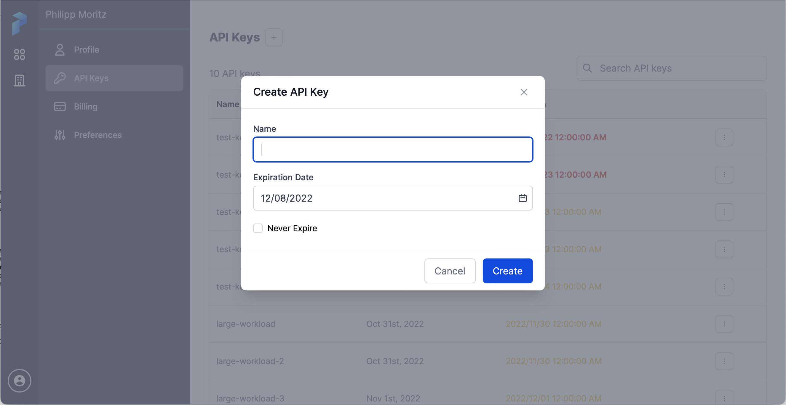

# Prefect Integration with Anyscale

This repository contains the integration of Prefect with Anyscale.

## Development Setup

For development,
we strongly recommend using Anyscale Workspaces together with [Prefect Ray](https://github.com/PrefectHQ/prefect-ray).
No further integration is needed and you can just run a Python script like
```python
import time

from prefect import flow, task
from prefect_ray import RayTaskRunner

@task
def shout(number):
    time.sleep(0.5)
    print(f"#{number}")

@flow(task_runner=RayTaskRunner)
def count_to(highest_number):
    for number in range(highest_number):
        shout.submit(number)

if __name__ == "__main__":
    count_to(10)
```
inside your workspace and connect to Prefect via `prefect login`. Please *do not* use the Ray or Anyscale Client, i.e.
do not use the `RayTaskRunner(address="ray://...")` or `RayTaskRunner(address="anyscale://...")` since these can
cause various issues (version mismatches between client and cluster, loosing connection, slower data transfer and API
calls between client and server etc).

## Production Setup

This repository is providing an integration between Anyscale and Prefect for production scenarios, where you
want to submit your experiments from the Prefect UI and have them run in Anyscale. It uses
[Prefect Ray](https://github.com/PrefectHQ/prefect-ray) internally and defines a Prefect agent that can run
as an Anyscale Service in your cloud account. This agent will pick work from the Prefect work queue, convert it
into an Anyscale Job that will run the work on a Ray cluster in the same way as the development setup (to keep
production and development close).

### Getting Started

To get started, you should first start the Anyscale Prefect Service in your Anyscale Cloud. It will be connected
to your Prefect UI, receive new work, convert it into Anyscale Jobs and run those inside of Anyscale. You can set
up the service from your laptop, you just need the Anyscale CLI installed. Generate a long lived Prefect API token
from the Prefect UI and check the "Never Expire" checkmark (you can always rotate the token and restart the service
with the new token if that becomes necessary):


