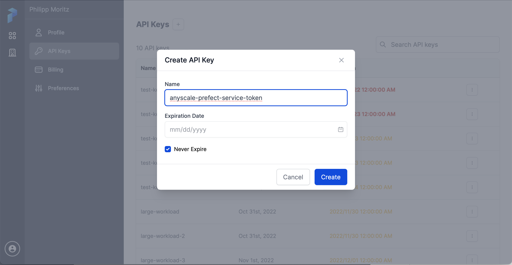
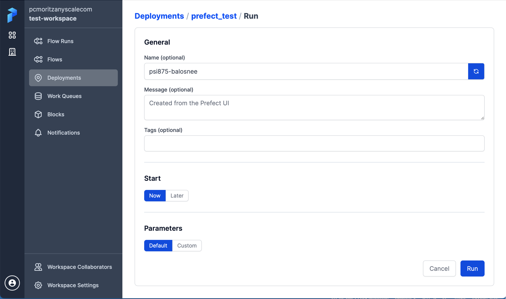
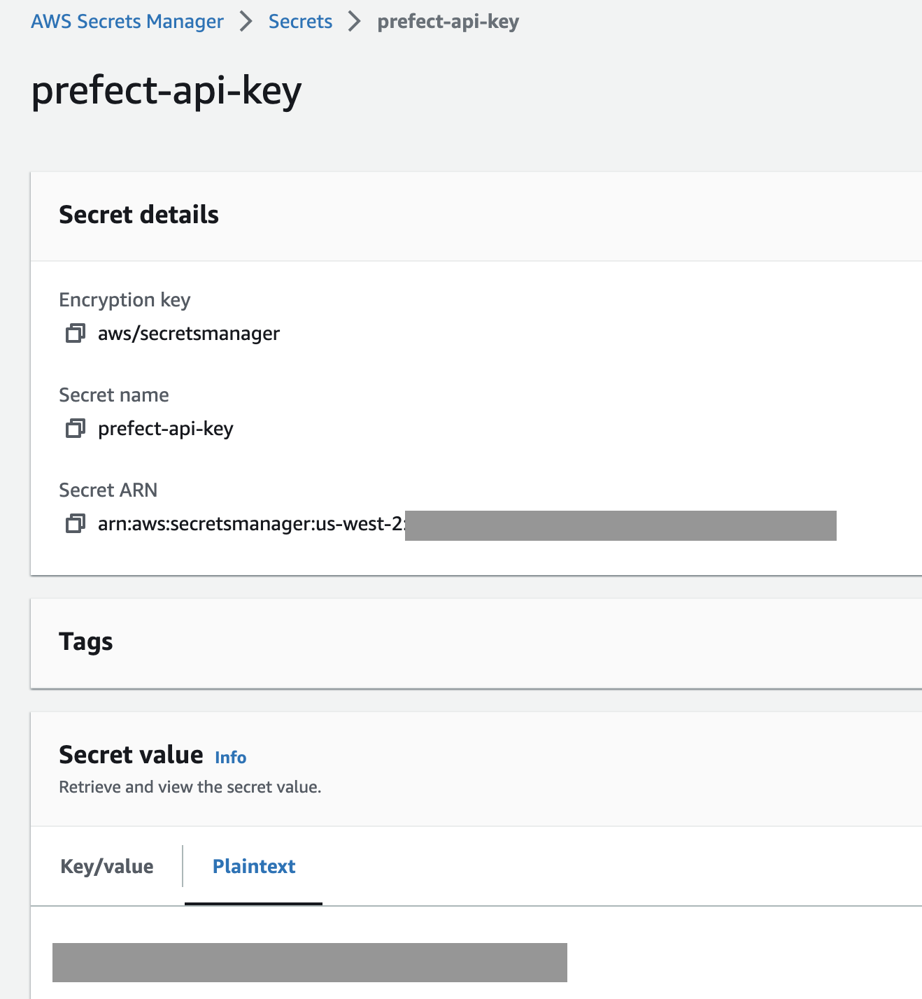

# Prefect Integration with Anyscale

This repository contains the integration of Prefect with Anyscale.

## Development Setup

For development, we strongly recommend using Anyscale Workspaces together with [Prefect Ray](https://github.com/PrefectHQ/prefect-ray).
No further integration is needed and you can just run a Python script like
```python
import time

from prefect import flow, task
from prefect_ray import RayTaskRunner

@task
def shout(number):
    time.sleep(0.5)
    print(f"#{number}")

@flow(task_runner=RayTaskRunner)
def count_to(highest_number):
    for number in range(highest_number):
        shout.submit(number)

if __name__ == "__main__":
    count_to(10)
```
inside your workspace and connect to Prefect via `prefect login`. Please *do not* use the Ray or Anyscale Client, i.e.
do not use the `RayTaskRunner(address="ray://...")` or `RayTaskRunner(address="anyscale://...")` since these can
cause various issues (version mismatches between client and cluster, loosing connection, slower data transfer and API
calls between client and server etc).

## Running Anyscale Jobs as part of a larger Prefect flow

You can run Anyscale Jobs as part of a Prefect flow like this:
```python
import os
import subprocess
import tempfile
import yaml

from prefect import flow, task, get_run_logger

@task
def execute_anyscale_job(args):
    job_config = {
        "name": "my-anyscale-job",
        "description": "An Anyscale Job submitted from Prefect.",
        "cluster_env": "default_cluster_env_2.3.1_py39",
        "runtime_env": {
            "working_dir": ".",
            "upload_path": "<path to your S3 bucket where the code should be stored>",
        },
        "entrypoint": "python my_job_script.py " + " ".join([f"--{key} {val}" for key, val in args.items()]),
    }

    with tempfile.NamedTemporaryFile(mode="w") as f:
        yaml.dump(job_config, f)
        f.flush()
        # Submit an Anyscale Job from Prefect and record the logs
        output = subprocess.check_output(
            ["anyscale", "job", "submit", f.name, "--follow"]
        )
        logger = get_run_logger()
        logger.info("Anyscale Job output: " + output.decode())

@flow
def flow_with_anyscale_job():
    execute_anyscale_job.submit({"arg": "value"})

if __name__ == "__main__":
    flow_with_anyscale_job()
```

## Using Anyscale as the compute infrastructure for Prefect workloads

This repository is providing an integration between Anyscale and Prefect for production scenarios, where you
want to submit your experiments from the Prefect UI and have them run in Anyscale. It uses
[Prefect Ray](https://github.com/PrefectHQ/prefect-ray) internally and defines a Prefect agent that can run
as an Anyscale Service in your cloud account. This agent will pick work from the Prefect work queue, convert it
into an Anyscale Job that will run the work on a Ray cluster in the same way as the development setup (to keep
production and development close).

### Getting Started

#### Setting up the Anyscale Prefect Service

This part only needs to be done once per Anyscale account to set up
the Anyscale Prefect agent (and subsequently to update it if desired).

To get started, you should first start the Anyscale Prefect Service in your Anyscale Cloud. It will be connected
to your Prefect UI, receive new work, convert it into Anyscale Jobs and run those inside of Anyscale. You can set
up the service from your laptop, you just need the Anyscale CLI installed. Generate a long lived Prefect API token
from the Prefect UI and check the "Never Expire" checkmark (you can always rotate the token and restart the service
with the new token if that becomes necessary):



From your laptop, then log into Prefect by running the following from your shell (substitute the API token you just generated):
```bash
prefect cloud login -k pnu_XXXXXXXXXXXXXXXXXXXXXXXXXXXXXXXXXXXX
```

We now need to create an Anyscale Service file for deploying the Anyscale Prefect Agent. First display the settings with
```bash
prefect config view --hide-sources
```
and create a `prefect-agent-service.yaml` file where you **fill in the information** displayed above in place of the `...`:
```yaml
name: prefect-agent
ray_serve_config:
  import_path: start_anyscale_service:entrypoint
  runtime_env:
    env_vars:
      PREFECT_API_URL: "https://api.prefect.cloud/api/accounts/..."
      PREFECT_API_KEY: "..."
      ANYSCALE_PREFECT_QUEUE: test
    pip: ["prefect-anyscale"]
    working_dir: https://github.com/anyscale/prefect-anyscale/archive/refs/tags/v0.2.1.zip
```

**NOTE**: This will store your Prefect API token in the service
definition, which can be accessed from the Anyscale UI.  If you want
to avoid this, you can store the token in the AWS Secrets Manager (or
another secret manager of your choice) and retrieve it from there in
`start_anyscale_service.py`.

The `working_dir` contains the version of the Anyscale Prefect agent, which you can upgrade going forward as new versions are released.
You can then start the service with
```bash
anyscale service deploy prefect-agent-service.yaml
```

Now create a Prefect infrastructure that will be used to run the deployments inside of Anyscale. You can do this
by running `pip install prefect-anyscale` and then in a Python interpreter
```python
import prefect_anyscale
infra = prefect_anyscale.AnyscaleJob(cluster_env="prefect-test-environment")
infra.save("test-infra")
```

#### Creating a deployment and scheduling the run

Now we can go ahead and create a Prefect deployment:
```python
import prefect
from prefect.filesystems import S3
from prefect_anyscale import AnyscaleJob

from prefect_test import count_to

deployment = prefect.deployments.Deployment.build_from_flow(
    flow=count_to,
    name="prefect_test",
    work_queue_name="test",
    storage=S3.load("test-storage"),
    infrastructure=AnyscaleJob.load("test-infra")
)
deployment.apply()
```

You can now schedule new runs with this deployment from the Prefect UI



and it will be executed as an Anyscale Job on an autoscaling Ray Cluster which has the same setup as the development setup described above.

#### Overriding properties of the infra block

You can override properties of the Anyscale infra block in a deployment like this

```python
import prefect
from prefect.filesystems import S3
from prefect_anyscale import AnyscaleJob

from prefect_test import count_to

deployment = prefect.deployments.Deployment.build_from_flow(
    flow=count_to,
    name="prefect_test_custom",
    work_queue_name="test",
    storage=S3.load("test-storage"),
    infrastructure=AnyscaleJob.load("test-infra"),
    infra_overrides={"compute_config": "test-compute-config"}
)
deployment.apply()
```
#### Using the AWS Secrets Manager for storing the PREFECT_API_KEY

We recommend using the AWS Secrets Manager for storing your PREFECT_API_KEY token. Store your
`PREFECT_API_KEY` secret as a Plaintext secret (not Key/value) like the following



and add the following policy to your `<cloud-id>-cluster_node_role` role:

```
{
  "Version": "2012-10-17",
  "Statement": [
    {
      "Effect": "Allow",
      "Action": "secretsmanager:GetSecretValue",
      "Resource": "<fill this out with the Secret ARN>"
    }
  ]
}
```

You can then run the agent by specifying a `ANYSCALE_PREFECT_AWS_SECRET_ID` and
`ANYSCALE_PREFECT_AWS_REGION` in your configuration yaml instead of the `PREFECT_API_KEY`,
see the `ci/prefect-agent-service-awssecrets-ci.yaml` file in this repository for an example.

### Using your own Prefect Agent

If you already have a setup with an existing Prefect agent working, you can use that agent
to run the Prefect Anyscale integration.

First make sure you
- Have the `prefect_anyscale` package installed in the Prefect Agent's environment and
- Are logged into Prefect or have set the `PREFECT_API_URL` and `PREFECT_API_KEY` environment
variables and
- Are logged into Anyscale or have set the `ANYSCALE_HOST` and `ANYSCALE_CLI_TOKEN` environment
variables

Then start the agent with
```
PREFECT_EXTRA_ENTRYPOINTS=prefect_anyscale prefect agent start -q <your prefect queue>
```

The agent will listen to new work on the specified queue and will execute flows that run with
the `AnyscaleJob` infra as Anyscale Jobs.
